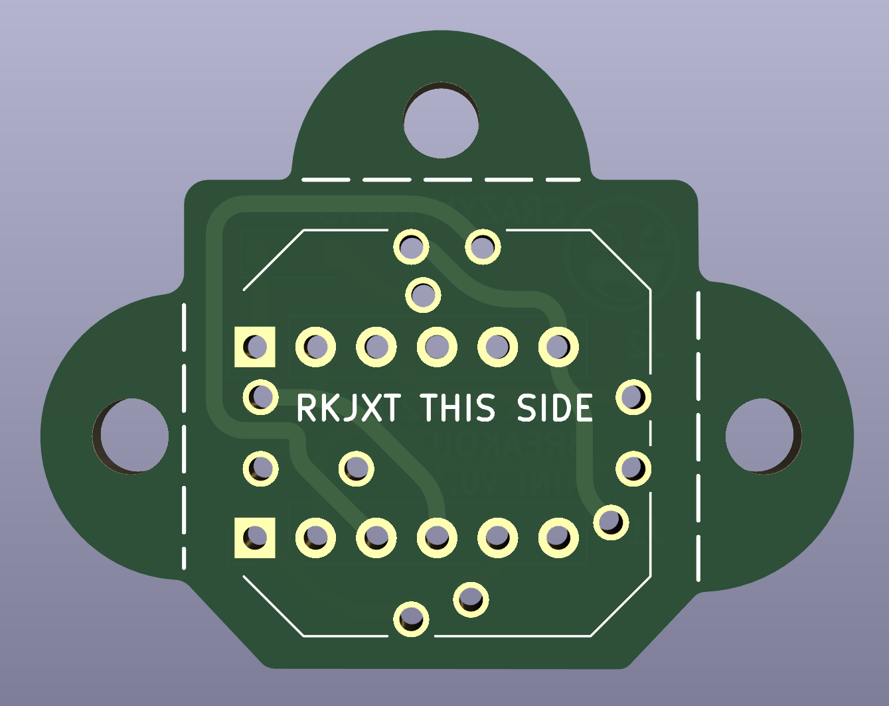
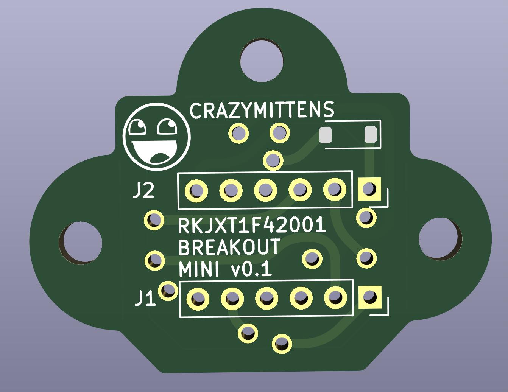
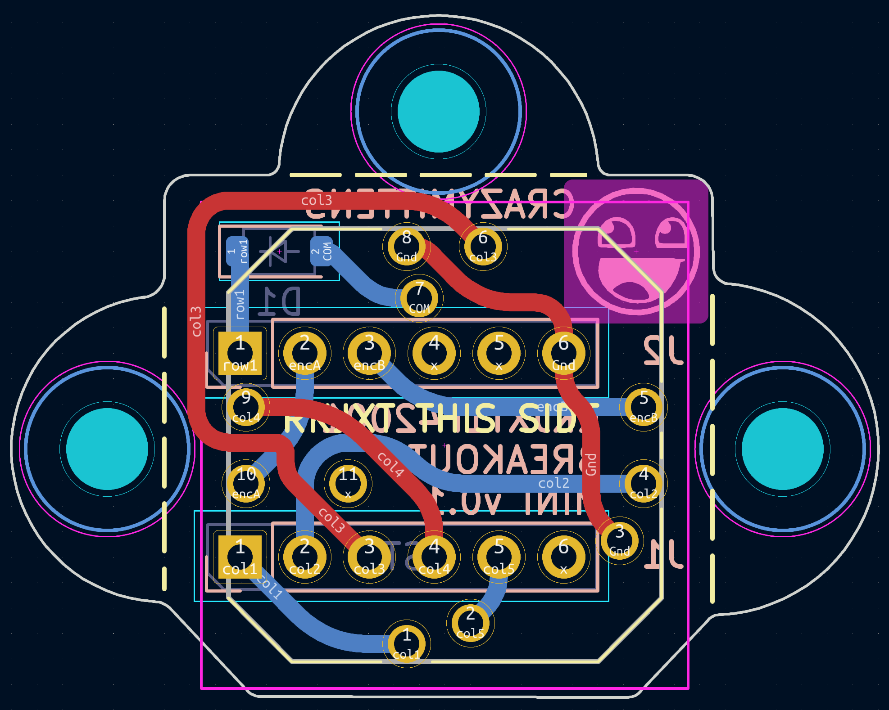
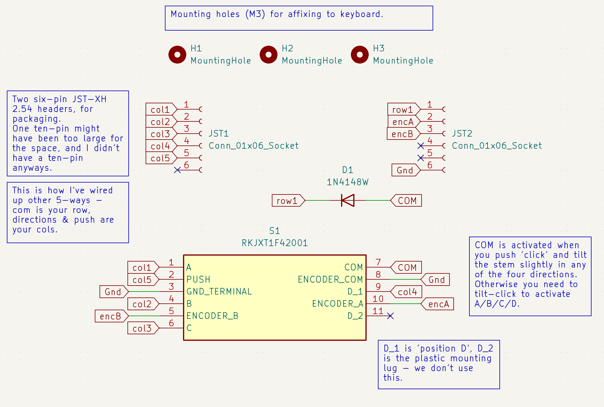

# rkjxt-mini-breakout
Mini-breakout for the RKJXT1F42001 multi-function switch

First time trying diy pcb.

The goal of this pcb is:
* minimal footprint
* mounting tabs
* 2.54mm pin spacing on breakout; ability to use 6-pin JST-XH 2.54mm headers
* SMD diode for row
* col2row, cols on A/B/C/D, row on COM

I needed a better 5-way switch for the mk18 project.  In the past I picked up some RKJXT1F42001 encoders/5-ways on the recommendation of QMK folks, but they needed a pcb to actually be used.
They have almost zero slop/play and fit in the same footprint as the other 5-way switches, plus have an EC11 encoder built-in, and a 'joystick' effect.

In theory I can keep the same used space and so the same mounting location, i.e. right above the trackball.

